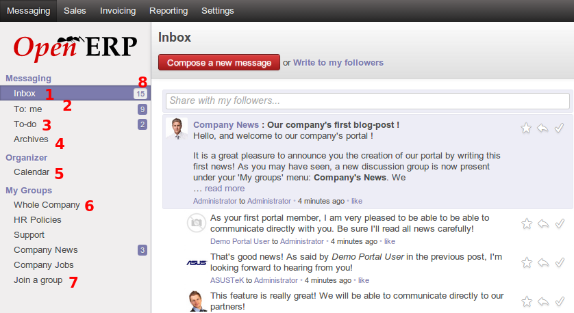
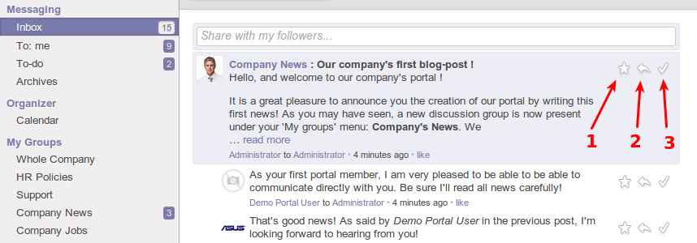
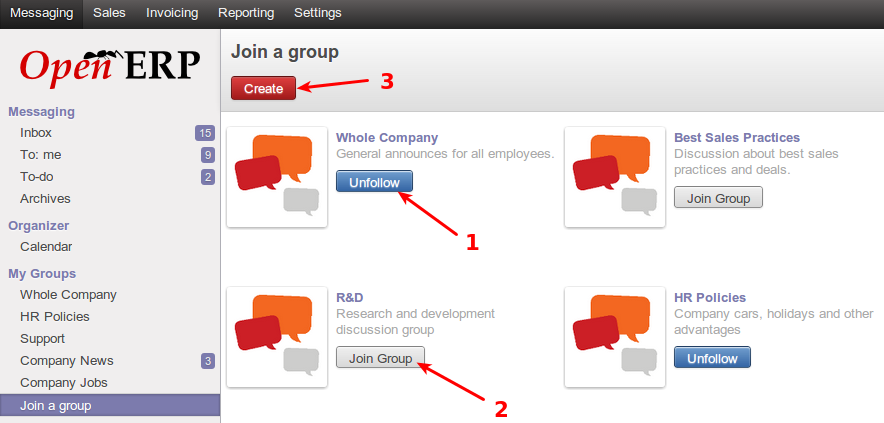
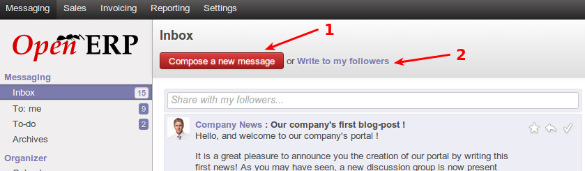
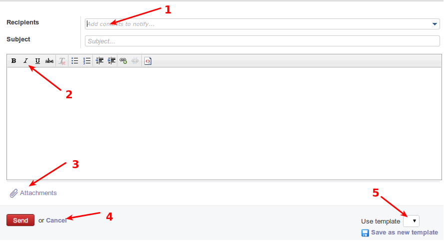
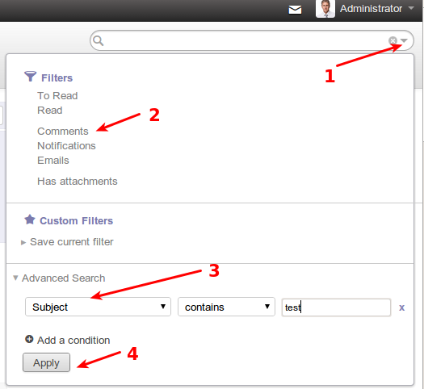
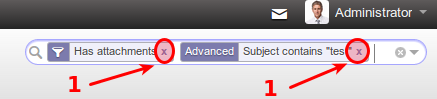
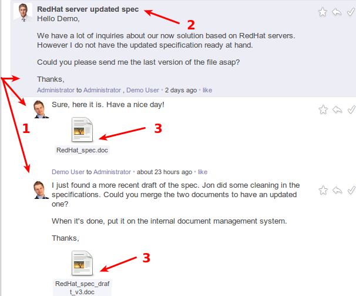
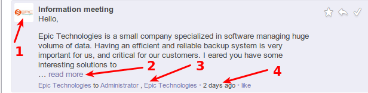

---------
Messaging
---------

^^^^^
About
^^^^^

Messaging is a new feature in OpenERP 7, which aims to keep all business communications within the ERP system, versus externally such as in separate email clients. Messages allow for an out and in flow of discussions directly from OpenERP to a contact/customer/partner/colleage. Messages also serves as a business todo list based on those communication flows, and discussion groups for mailing list functionality for business teams.

^^^^^^^^^
Sub menus
^^^^^^^^^

The following screenshot displays the main sub menu items of the messaging functionality, and some explanations on what they do.

1. User inbox, this displays all unread communications for which the user is a part of. Messages that are marked done do not display here, messages marked todo are not displayed here. This box should be kept empty, and messages either marked done after reading them, or marked todo if they are actionable. An empty inbox represents an ideal period in which there are no business communications for which the user is unaware.

2. These are messages which were send directly to the user, and are therefore a lot more relevant to the given user. Messages here should also ideally be read and marked done or todo, and cleared from view.

3. These are messages marked todo from previous boxes, and require user action. Once the user has acted on the message, the user marks the message done. This serves as a todo list based off the business communications.

4. Archives are where all messages marked done, will be kept. They are meant to be out of sight and out of the way, but available to find if required. This box typically will only be used when the user requires information from previous messages marked done.

5. This is the OpenERP calendar for the user, showing user meetings and other colleague meetings as well.

6. Groups are mailing lists for collaborative messaging. Once a user joins a group, the user will see all new communications for the group, and will also be able to post messages to the group. All other members of the group can read and comment on the messages, this is a mailing list like feature for group discussions.

7. This is where a user can find new groups within the company, or even create a new group if permissions allow. Once a group is selected and joined, a sub-menu list with the group will be shown to the user.

8. Unread messages count. This is a count of messages that the user has not read in the respective box.

^^^^^^^^^^^^^^^^
Message marking
^^^^^^^^^^^^^^^^

The following screenshot displays the buttons used to mark messages as done, or todo, or to reply to the message.

1. Mark this message as todo. If the message is actionable to the user, this marks the message as todo, and moves the message out of the current box. The message will then be seen in the todo sub menu. 

2. This replies to the message, providing an input box below the message, in which the user can type the reply and send it.

3. Mark message as done. This moves the message into the archive and out of sight, but accessible if later needed for any reason.

^^^^^^
Groups
^^^^^^

The following screenshot displays user actions within the groups area of messaging.

1. Leave a group. Each user by default is part of a group called "Whole company", but also a part of other groups the user elected to be in. A user can at any time leave a group by selecting unfollow on a group.

2. Join a group. A user can join a group that he/she has permissions for, and can thereafter read and post new messages within the joined group.

3. A user may create a group if he/she has permissions, other users can then join the group.

^^^^^^^^^^^^^^^^
Sending messages
^^^^^^^^^^^^^^^^

The following screenshot displays the interface for sending messages to other users or contacts/customers/partners etc

**Followers**: In OpenERP 7, any user is able to follow other users/contacts/customers/partners, or even documents. All messages then sent to and from a person/document's follower message composer will be received by the user (being a follower). Replies to such messages is also seen by all followers of the person/document. Followers is like group messaging, centered around a contact/person/document etc. They can be seen as mini groups that come and go with documents or persons, for which discussions are based around.

OpenERP 7 allows a user to compose a message to any person, or a shortcut to write to all followers of a person/document.

1. This button allows a user to generically compose a new message to any person or contact.

2. This is the shortcut to compose and send a message to followers of the user. (All others following you)

The screenshot below displays the generic message compose window

1. This is where recipients will be entered, simply typing the recipients starting email or name, will offer choices based on contacts within the system. More than one recipient may be entered here.

2. These are rich text formatting options which can be used to compose this message

3. This allows a user to attach a file from his/her PC, to the message. This is the same as attachments in email. The user can select a file from their local system to be sent.

4. These buttons send the message or cancel the compose.

5. This allows a user to select a template, with predefined message body content and formatting (templates will be discussed later)

^^^^^^^^^^^^^^^^^^
Message Searching
^^^^^^^^^^^^^^^^^^

The following screenshot displays the searching options in the messaging section. Searching can be done with the universal search bar as indicated.

1. To access the advanced search options, this dropdown icon should be clicked. It presents advanced search filters that is relevant for the area in which the user is working.

2. These are quick filters, clicking on them applies the filter immediately, they are shortcuts for commonly needed filters.

3. Advanced search for message components, such as subject, author, attachments, etc

4. Apply advanced search.

The following screenshot displays how to remove applied filters to a search.

1. Each applied filter displays in the universal search bar as a box. Clicking on the 'x' on the right end of the box for the filter, removes the filter and searches without that filter

^^^^^^^^^^^^^^^^
Message viewing
^^^^^^^^^^^^^^^^

The following screenshot displays a typical message thread

1. Threaded messages. A conversation and its replies are kept together in a thread to read. The original message is shown on the top, and each reply thereafter are displayed underneath with left indentation to visually show that the message is part of a thread.

2. The message subject is shown once on the original, which is the top most message in the thread. The subject is bolded for quick viewing.

3. Attachments in messages are shown in preview of the messages they are sent with. Clicking on any of the attachments allows the user to download the attachment locally, and open and view it.

The following screenshot outlines more info on a typical message display

1. Picture of original message sender. If the contact in the system has an image assigned, it is displayed here, otherwise a default image is displayed.

2. If the message text is long, the message is previewed and the rest of the message is hidden. To display the entire message in question, the "read more" link can be clicked.

3. Recipients of the message can be seen at a glance at the bottom of a given message

4. Message age can be seen at a glance at the bottom of a given message

